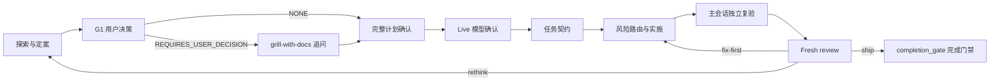

# Coding-Review Pipeline

[](https://skills.sh/Yohmien/coding-review-pipeline)
[](https://github.com/Yohmien/coding-review-pipeline/actions/workflows/validate.yml)
[](LICENSE)


`coding-review-pipeline` 是用于项目源码和自动化测试变更的 Codex skill。主会话负责范围、契约、风险和最终证据；coding 子代理按任务契约实施；fresh reviewer 只读审查实际 diff。子代理的完成报告不能替代工作树和命令结果。

它不替代项目自身的 `AGENTS.md`、测试体系或代码审查规范，而是把这些约束接入一条可恢复、可验证的执行流程。

## 适用范围

- 实现功能、修复缺陷、重构源码或补充自动化测试。
- 多任务或跨模块改动，需要明确依赖、写集和并发边界。
- 涉及公共 API、事务、并发、迁移或外部副作用，需要先确认决策再实施。

纯解释、仓库搜索、命令执行、文档或配置单独修改、只读 review 不进入完整 coding 流水线。

## 工作流



低风险且用户明确授权的局部修改可走 `DIRECT_PATCH`；已确认计划与模型的连续任务可从检查点继续。多任务执行时，主会话持续调度 ready 且写集互斥的任务，并让独立 task review 与其他 coder 并发；final integration review 保持为全局收口点。

运行规则以 [SKILL.md](skills/coding-review-pipeline/SKILL.md) 与 `references/` 为准。

## 处理的工程问题

| 问题 | 流水线处理方式 |
|---|---|
| 需求存在高影响互斥选择 | G1 只在确有用户决策时调用 `grill-with-docs` |
| 搜索与影响面缺少证据 | `search-gates` 按图谱、记忆和精确文本逐层收敛 |
| 任务拆分后仍被串行执行 | `task_graph.py` 计算 ready 与写集关系，主会话持续填充可用 agent slot |
| 编译失败被误当成 TDD 红灯 | 只有实际测试执行且目标行为断言失败才算有效 RED |
| coder 自报完成但没有独立证据 | 主会话检查实际 diff 并重跑验证 |
| review 被实现过程污染 | 每次使用 fresh、只读 reviewer，diff 变化后旧 verdict 失效 |
| 长任务重复规划或频繁轮询 | 从已确认检查点继续；无状态变化的异步等待保持静默 |

## 五 Gate 路由（V2）

程序路由以 `skills/coding-review-pipeline/scripts/route_context.py` 输出为准，可读契约见 `references/routing-gates.md`。五个 Gate 正交，任一 Gate 的输出不得用作另一 Gate 的触发条件：

| Gate | 只回答一个问题 | 输出 |
|---|---|---|
| G1 User Decision | 是否存在仓库事实无法确定，并且会改变实现结果、范围、接口或验收标准的用户决定？ | `NONE` / `REQUIRES_USER_DECISION`（唯一路由 grill-with-docs 的入口；多文件、多模块、工具/测试/阅读数量一律不触发） |
| G2 Risk | 风险等级（只决定 advisor / verification tier / review tier） | `NORMAL` / `ELEVATED` / `HIGH`（candidate 只能升到 ELEVATED，confirmed 才决定 HIGH） |
| G3 Decomposition | 任务数量（Task Right-Sizing） | `single` / `multiple` |
| G4 Execution | 执行模式（写集相交或有依赖链 → serial） | `single` / `serial` / `parallel-safe` |
| G5 Recovery | 是否需要恢复（incomplete ledger / running agent / dirty baseline / interrupted run / context recovery / unknown mutation） | `none` / `required`（唯一加载 recovery-and-failures.md 的入口） |

## 确定性组件

| 组件 | 职责 |
|---|---|
| `scripts/change_facts.py` | 工作树 change facts：changed/untracked files、diff ranges、风险候选、write-set overlap |
| `scripts/route_context.py` | G1-G5 门控，路由 references / skills / tools 与 reasons |
| `scripts/task_graph.py` | 任务图：环检测、拓扑序、ready queue、write-set overlap、parallel-safe |
| `scripts/validate_task_packet.py` | 派发前校验 coder task packet；BLOCKED 附 evidence |
| `scripts/run_ledger.py` | 持久 run ledger、原子 update、resume_state、verification tier |
| `scripts/agent_lifecycle.py` | coder / reviewer / advisor 生命周期，固定 8 actions |
| `scripts/task_convergence.py` | task 级收敛：CONTINUE_FIX / ENTER_RETHINK / SHIP / STOP / TASK_ESCALATION_REQUIRED 等 7 routes |
| `scripts/review_preflight.py` | review 确定性前置：detect-and-reuse、归一化、diff 归因、negative coverage、P0-P3 context |
| `scripts/completion_gate.py` | 完成门禁：COMPLETE_ALLOWED / BLOCKED + 确定性 reasons（invalid_plan / plan_stale 等） |
| `skills/contract-executor`（兄弟 skill） | coding 子代理的机械执行状态机（READ → IMPLEMENT → VERIFY → REPORT） |

全部组件行为由 `tests/` 的 510 项单元测试锁定（见「质量与测试」）。

## Review 与完成门禁

`scripts/review_preflight.py` 在 reviewer 开始前完成 analyzer 探测、finding 归一化、diff 归因、negative coverage 和 P0-P3 上下文整理。可归因的构建、测试、安全或项目配置分析器失败直接阻断；reviewer 负责语义审查，不重复机器检查。

`open-code-review`（`ocr`）只提供额外规则上下文。不可用时记录 `SKIPPED` 并继续，不影响 review verdict。

## 执行边界

- 主会话只在仓库事实和已确认决策足够时定案；未决高影响选择交还用户。
- coder 只能修改 packet 的 `WRITE_SET`，不能扩展接口、依赖或验收标准。
- 并发只用于无依赖且写集互斥的任务；冲突分量局部串行。
- reviewer 只读，不亲自修复；`fix-first` 回原 coder，修复后重新 review。
- `completion_gate.py` 放行前不得声明全部完成。

## 安装

前置：Codex（CLI 或 Desktop）。本 skill、兄弟 skill `contract-executor` 与全部依赖都安装到 `$CODEX_HOME/skills`（默认 `~/.codex/skills`），目录名必须与 SKILL.md frontmatter 的 `name` 一致。可选增强是 CodeGraph 与 `ocr` CLI，见「OPTIONAL 依赖」小节。

> [!IMPORTANT]
> Codex 的 skills **没有依赖解析**：安装本 skill 不会自动安装它的依赖。CORE 与 CONDITIONAL 依赖必须一起安装，否则流水线在加载阶段报告缺失并停止（fail closed）；OPTIONAL 依赖缺失不阻断。兄弟 skill `contract-executor` 必须同步安装，缺失时不得派发 coding 子代理。

### 方式 1：在 Codex 会话内安装

让 Codex 使用内置 `$skill-installer`：

```text
$skill-installer install https://github.com/Yohmien/coding-review-pipeline/tree/main/skills/coding-review-pipeline
```

依赖同理，逐个给出目录 URL（见下方依赖表）。安装完成提示：skill 将在**下一轮对话**生效。

### 方式 2：skills.sh CLI

```bash
npx skills@latest add Yohmien/coding-review-pipeline
```

选择要安装的 skills 时，至少勾选 `coding-review-pipeline`、`contract-executor` 以及依赖表中 CORE / CONDITIONAL 的全部条目。

### 方式 3：从仓库安装

```bash
# macOS / Linux
mkdir -p ~/.codex/skills
cp -R skills/coding-review-pipeline ~/.codex/skills/
cp -R skills/contract-executor ~/.codex/skills/

# Windows PowerShell
Copy-Item -Recurse skills/coding-review-pipeline -Destination "$HOME\.codex\skills\"
Copy-Item -Recurse skills/contract-executor -Destination "$HOME\.codex\skills\"
```

### 依赖安装

依赖按 CORE / CONDITIONAL / OPTIONAL 三分类；外部依赖建议用各来源的官方安装方式，随本仓库分发的依赖由安装脚本直接复制，或直接运行本仓库的 `scripts/install-deps` 一键装齐（见「仓库结构」）。

```bash
# macOS / Linux
bash scripts/install-deps.sh

# Windows PowerShell
powershell -ExecutionPolicy Bypass -File scripts/install-deps.ps1
```

#### CORE（任何编码任务必需；缺失即停止）

| 依赖 skill | 角色 | 权威来源 | 安装方式 |
|---|---|---|---|
| `contract-executor` | 兄弟 skill：coding 子代理机械执行状态机 | 随本仓库（`skills/contract-executor`） | 随仓库复制；缺失时 fail closed，不派 coding 子代理 |
| `search-gates` | 结构搜索闸门 | 随本仓库开源（`vendor/skills/search-gates`） | 随仓库复制，`install-deps` 自动处理 |
| `verification-before-completion` | 完成声明门禁 | [obra/superpowers](https://github.com/obra/superpowers) | `npx skills@latest add obra/superpowers --skill verification-before-completion -y -g` |
| `ponytail` | 最简可行解纪律 | [DietrichGebert/ponytail](https://github.com/DietrichGebert/ponytail) | `npx skills@latest add DietrichGebert/ponytail --skill ponytail -y -g` |
| 内置引用 + 脚本 | `references/` 全部文件与 `scripts/` 全部脚本 | 随本仓库 | 随 `skills/coding-review-pipeline/` 一起复制，无需单独安装 |

#### CONDITIONAL（按 Gate/阶段命中加载；命中条件成立但缺失时停止对应流程）

| 依赖 skill | 角色 | 命中条件 | 权威来源 | 安装方式 |
|---|---|---|---|---|
| `grill-with-docs` | G1 追问门禁 | 仅 G1 输出 `REQUIRES_USER_DECISION` | [mattpocock/skills](https://github.com/mattpocock/skills) | `$skill-installer install https://github.com/mattpocock/skills/tree/main/skills/engineering/grill-with-docs` 或 `npx skills@latest add mattpocock/skills` |
| `grilling` | 传递：决策树与分轮追问 | 随 grill-with-docs | [mattpocock/skills](https://github.com/mattpocock/skills) | `https://github.com/mattpocock/skills/tree/main/skills/productivity/grilling` |
| `domain-modeling` | 传递：glossary / ADR 维护 | 随 grill-with-docs | [mattpocock/skills](https://github.com/mattpocock/skills) | `https://github.com/mattpocock/skills/tree/main/skills/engineering/domain-modeling` |
| `systematic-debugging` | 根因调试闭环 | 缺陷修复且 root cause 未建立 | [obra/superpowers](https://github.com/obra/superpowers) | `npx skills@latest add obra/superpowers --skill systematic-debugging -y -g` |
| `test-driven-development` | 红灯先行 | 可测实现 | [obra/superpowers](https://github.com/obra/superpowers) | `npx skills@latest add obra/superpowers --skill test-driven-development -y -g` |
| `references/recovery-and-failures.md` | 恢复 if-then 表（文件本身属 CORE 分发清单） | 仅 G5 输出 `required` | 随本仓库 | 随 skill 一起复制 |

#### OPTIONAL（增强，可缺失；缺失不阻断）

| 依赖 | 角色 | 缺失行为 | 权威来源 | 安装方式 |
|---|---|---|---|---|
| `open-code-review`（`ocr` CLI） | review 的 optional rule enrichment | `review_preflight.py` 输出 `ocr.state=skipped` 并继续，绝不 STOP review | [alibaba/open-code-review](https://github.com/alibaba/open-code-review) | `npm install -g @alibaba-group/open-code-review`（需 Node ≥14；要求 Git ≥2.41） |
| CodeGraph | search-gates 的图谱层 | search-gates 降级 rg 锁定或报告缺失，不假装命中 | [colbymchenry/codegraph](https://github.com/colbymchenry/codegraph) | 官方 install.ps1 / install.sh 或 `npm i -g @colbymchenry/codegraph` |

### OPTIONAL 依赖：CodeGraph（search-gates 的图谱层）

`search-gates` 的图谱闸门（Step 1）依赖 **CodeGraph**：项目根 `.codegraph` 索引 + `codegraph explore` CLI（或 `codegraph_explore` MCP）。它在 Codex 内以「AGENTS.md 指令块 + MCP server」形式生效，效果等同于一个常驻 skill 级能力，但**不是** SKILL.md 目录，不能用 `$skill-installer` 安装；`install-deps` 也不会、不应安装它（外部工具，且需每项目索引决策）。请按官方链路单独安装：

```bash
# 1) 安装 CLI（三选一；安装后需重开终端）
# macOS / Linux
curl -fsSL https://raw.githubusercontent.com/colbymchenry/codegraph/main/install.sh | sh
# Windows PowerShell
irm https://raw.githubusercontent.com/colbymchenry/codegraph/main/install.ps1 | iex
# 已装 Node 的任意平台
npm i -g @colbymchenry/codegraph

# 2) 接线到 Codex：写入 [mcp_servers.codegraph] 配置 + AGENTS.md 指令块
codegraph install

# 3) 在目标项目建立图谱索引（创建 .codegraph/ 并完成首次建图）
cd <项目根目录>
codegraph init

# 随时升级
codegraph upgrade
```

缺失时图谱闸门不可用，search-gates 会按失败兜底表降级到 Step 3 rg 锁定（显式路径）或报告缺失，不假装命中；本 skill 不因 CodeGraph 缺失而停止。

### OPTIONAL 依赖：open-code-review（review 的 rule enrichment）

fresh review 的确定性前置是 `scripts/review_preflight.py`（见「典型流程与 review 前置」）。`ocr` 只是该前置之上的 optional rule enrichment：preflight 检测到 `ocr` 时用 `ocr delegate rule` 生成附加规则上下文（`ocr.rule_context`）。它**不是** SKILL.md 目录，不能用 `$skill-installer` 安装；`install-deps` 只检测并提示，不自动全局安装。请按官方链路单独安装：

```bash
# 需要 Node ≥14（npm 或 pnpm 全局安装均可）
npm install -g @alibaba-group/open-code-review

# 验证
ocr delegate rule --help
```

要求 Git ≥2.41。ocr 不可用时，preflight 输出 `ocr.state=skipped` 并继续，review 照常按 machine findings / coverage / context 完成，绝不因此 STOP；可选给出安装提示，不因 ocr 不可用重新派发 reviewer。

### 验证安装

```bash
# 列出已安装目录（应看到 coding-review-pipeline、contract-executor 与全部依赖）
ls ~/.codex/skills

# 校验 frontmatter：目录名必须等于 SKILL.md 中的 name
head -3 ~/.codex/skills/coding-review-pipeline/SKILL.md

# 校验本 skill 与兄弟 skill contract-executor（frontmatter name 与目录名一致）
python scripts/validate.py skills/coding-review-pipeline skills/contract-executor

# 确认内置引用与脚本完整（references/ 九份文件 + scripts/ 全部组件）
ls skills/coding-review-pipeline/references skills/coding-review-pipeline/scripts

# 验证 CodeGraph（OPTIONAL；Windows 用 Test-Path .codegraph）
codegraph status

# 验证 ocr（OPTIONAL；Windows 用 Get-Command ocr）
ocr delegate --help
```

期望输出：`coding-review-pipeline` 与 `contract-executor` 均打印 `Skill is valid!`，`name` 与目录名一致；`contract-executor` 缺失视为安装不完整（fail closed），不得开始编码任务；`codegraph status` 正常返回索引状态（无索引时按 search-gates 的失败路径处理）；`ocr delegate --help` 缺失不阻断安装验证。

## 质量与测试

- `tests/` 共 11 个测试模块、**510 项单元测试**，覆盖全部确定性组件与契约执行器：`python -m unittest` 全绿。
- `scripts/validate.py` 校验 skill 目录的 frontmatter 与结构；CI（`.github/workflows/validate.yml`）对 `skills/` 与 `vendor/` 持续跑同一校验。
- `test-prompts.json` 的 8 个场景锁定首次响应门禁、只读 review、live schema 复用和 reviewer 角色隔离等行为。

## 内置参考文件

`references/` 的九份文件随主 skill 一起安装，并按阶段读取：

- **routing-gates.md** — G1-G5 可读契约与正交性约束。
- **review-routing.md** — `review_preflight.py` 行为口径：detect-and-reuse、统一 finding schema、归因/去重、机器阻断、negative coverage、P0-P3、pmd/checkstyle detect-only、ocr optional。
- **run-ledger.md** — 持久 run ledger、run_id 规则、update 写门禁、畸形 ledger 逐命令映射、verification tier。
- **task-contracts.md** — coder / advisor / reviewer 任务契约与上下文传递规则。
- **recovery-and-failures.md** — 基线台账、线程回收、中断恢复决策表与 if-then 失败表。
- **agent-lifecycle.md** — 固定 8 actions 生命周期语义。
- **task-convergence.md** — task 级收敛路由与 failure context capsule。
- **task-right-sizing.md** — Task 定义与拆分算法（配套 task_graph.py）。
- **verification-routing.md** — verification tier 路由与验证记录规则。

`scripts/` 目录是确定性组件（见「确定性组件」表），与 references 同等重要：任一缺失都按 recovery-and-failures.md 的失败路径处理，不继续派发。

## 依赖缺失时

流水线的不可变原则之一：**不静默降级**。三分类语义：

- CORE 缺失（`search-gates` / `verification-before-completion` / `ponytail` / 内置引用与脚本 / `contract-executor`）→ 报告缺失项并停止，不降级、不找替代。
- CONDITIONAL 命中条件成立但缺失：G1 命中缺 `grill-with-docs`（或传递的 `grilling` / `domain-modeling`）→ 不进入追问门禁，报告并停止；缺陷修复缺 `systematic-debugging`、可测实现缺 `test-driven-development` → 停止对应流程；G5 命中缺 recovery-and-failures.md → 按内置失败路径处理。
- OPTIONAL 缺失不阻断：ocr 不可用 → preflight 输出 SKIPPED 并继续 review；目标项目没有 `.codegraph` 索引 → search-gates 图谱闸门不可用，按兜底表降级 rg 锁定或报告缺失，不假装命中。

## 运行注意事项

1. 安装写全局目录 `~/.codex/skills`；在受限沙箱中会被拦截，需提升权限或由用户手动复制。
2. 安装完成后 skill 在**下一轮对话**生效；本会话内不要假设它已可加载。
3. 校验：目录存在、frontmatter `name` 等于目录名、`references/` 与 `scripts/` 完整、兄弟 skill `contract-executor` 已同步安装（缺失 fail closed）、`python scripts/validate.py skills/coding-review-pipeline skills/contract-executor` 输出 `Skill is valid!`。
4. 依赖缺失按三分类处理：CORE 或命中的 CONDITIONAL 缺失时停止；OPTIONAL 缺失不阻断。

## 仓库结构

```text
.
├── README.md
├── LICENSE                        ← MIT
├── skills/
│   ├── coding-review-pipeline/
│   │   ├── SKILL.md
│   │   ├── test-prompts.json
│   │   ├── agents/openai.yaml
│   │   ├── references/            ← 九份内置引用（routing-gates / review-routing / run-ledger / task-contracts / recovery-and-failures / agent-lifecycle / task-convergence / task-right-sizing / verification-routing）
│   │   └── scripts/               ← 确定性组件（change_facts / route_context / task_graph / validate_task_packet / run_ledger / agent_lifecycle / task_convergence / review_preflight / completion_gate / crp_common）
│   └── contract-executor/         ← 兄弟 skill：coding 子代理机械执行（须同步安装）
├── vendor/skills/                 ← 随本仓库开源的依赖副本
│   └── search-gates/
├── scripts/
│   ├── install-deps.sh            ← 一键安装全部依赖（含 vendor）
│   ├── install-deps.ps1           ← Windows 等价脚本
│   └── validate.py                ← 校验 skill 目录 frontmatter
├── tests/                         ← 确定性组件全量回归测试（11 模块 / 510 项）
└── .github/workflows/validate.yml ← CI：对 skills/ 与 vendor/ 跑 validate.py
```

`vendor/skills/` 中每个目录的 SKILL.md 保留原 frontmatter `name`；复制到 `$CODEX_HOME/skills/` 时以该 `name` 为目录名。

## 许可证

[MIT](LICENSE)
